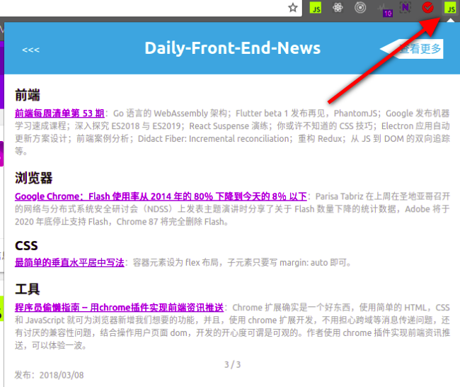

> # chrome-Daily-Front-End-news

## 使用

- [安装](https://chrome.google.com/webstore/detail/front-end-news/dcijaoifeaaafbdglmalaajeedcamogg?utm_source=chrome-app-launcher-info-dialog)

## 开发

- clone 仓库；
- 在 chrome 扩展程序页面点击 **加载已解压的扩展程序**，选择该仓库；
- 调试
	- 点击 **重新加载 (Ctrl+R)** 查看仓库修改过来的结果；
	- 点击 **背景页** 调试 **background** 的代码；
	- 在 popup 页面右键检查，调试 **popup** 的代码；

## 贡献

- 目前扩展处于初始阶段，为向大家服务的更好，仍需不断完善；
- 扩展显示的资讯来源于仓库 [Daily-Front-End-News](https://github.com/FengShangWuQi/Daily-Front-End-News)，作者会很高心收到你的 PR；

## TODO

- [ ] 更换 icon；
- [ ] 优化 UI；
- [ ] 限制切换次数，优化储存；
- [ ] 添加新内容，例如来源，作者信息，图片等；
- [ ] 添加新功能，例如查看全部等；
